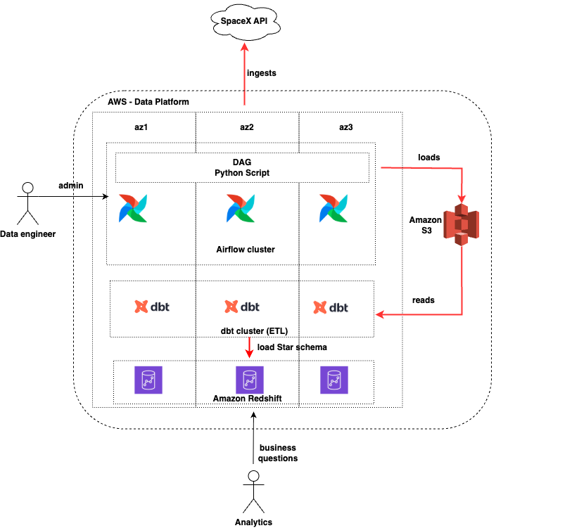

## Problem - Part 1: Data Infrastructure on AWS

- Provide an architectural diagram for a scalable data solution on AWS that includes the following
components: data storage and data processing.
- Describe how you would handle security and access control in this architecture.
- Write a small Terraform configuration file to create a simple Redshift cluster on AWS (if you don’t
want to go deeply into VPC, subnet, and security configurations you can explain it instead).

## Solution
 
In order to be able to run analytics against `SpaceX data set` a candidate data platform could be: 

### Components

- **Airflow cluster**: It would be responsible to orchestrate the tasks to extract the data
from the [SpaceX API](https://github.com/r-spacex/SpaceX-API/tree/master/docs). This cluster would
be deployed in K8S EKS where the webserver, scheduler and tasks would be deployed across different
nodes and availability zones ensuring scalability, availability and fault tolerance.  

- **DAGs:** For this particular use case, the DAG would be a set a python scripts that would extract
the data from the different entities of the SpaceX data model (capsules, company, cores, crew, ...,
launches) and load them in raw format (JSON) into Amazon S3.

- **Amazon S3**: It is a cloud-based object storage service that allows versioning, archival and
durability. It would store the initial dataset in Json format. 

- **DBT:** It would be responsible to run ETLs, extracting raw data from S3, running
data quality tasks, transforming to a Star schema data model and load into Amazon Redshift. This
cluster would be deployed in K8S EKS across different nodes and availability zones ensuring
scalability, availability and fault tolerance.

- **Amazon Redshift**: Data warehouse deployed across the different availability zones ensuring
scalability, availability and fault tolerance.

### Security and Access Control

#### For the Kubernetes (EKS) cluster running Airflow and DBT:

I would deploy the entire cluster inside a `private VPC`, meaning it is completely isolated from the
public internet. No one can access Airflow or DBT UIs or pods directly unless they’re inside the
private network or connected through a secure access method.
To control what the pods can do, I would use `AWS IAM Roles` linked to `Kubernetes service accounts`.
This way, Airflow and DBT get the exact permissions needed to read/write specific S3 buckets or
connect to Redshift.
I would  also enforce `Kubernetes Network Policies` so pods only communicate with the components they
need to. Secrets like API keys or database passwords would be stored securely using `AWS Secrets
Manager` or `Kubernetes Secrets`. The Airflow web UI would be behind authentication and use HTTPS
to ensure only authorized users get access.

#### How people can securely access Airflow and DBT in this private network:

Since the cluster is not reachable from the public internet, users need a secure “bridge” in.
One way is to use a `bastion host` — a small, locked-down server in a public subnet. Users SSH into
this host and then create secure tunnels to reach Airflow or DBT inside the private network. This
limits exposure to just the bastion, which you can tightly control.
Another option is an `authenticated reverse proxy` (like NGINX or AWS Application Load Balancer)
that sits at the network edge. It forces users to authenticate (using OAuth, SAML, etc.) before
letting them reach Airflow or DBT, all over HTTPS. The proxy then forwards authorized requests
securely to the private cluster.

#### When talking to the SpaceX API:
Since it is a public API and does not require authentication, I would still want to control outbound
traffic. I would restrict the cluster’s internet access to only allow calls to `specific IP ranges`
or `domains` owned by the SpaceX API. This keeps the environment safe from unexpected or unwanted
outbound connections.

#### For storing raw data in S3:
The S3 buckets would have strict access policies so only Airflow and DBT roles can access them.
I would enable `encryption` using `AWS KMS keys` to keep data safe even if someone got unauthorized
access. `Versioning` would be on to protect against accidental deletes or overwrites. Plus, the
buckets would be private with no public access, and accessed only through `VPC endpoints` to keep
traffic within the AWS network.

#### For Redshift:
I would keep Redshift in a `private subnet` inside the VPC. Only trusted services and users would be
allowed to connect, controlled by IAM roles or database permissions. Data in Redshift would be
encrypted at rest and in transit, and audit logging would be enabled to track all access.

#### Data moving around:
All communication between components, and between the cluster and external services, would use
`HTTPS` or `SSL` to ensure data is encrypted in transit.

#### Monitoring and alerts:
I would collect logs centrally and set up alerts for suspicious activity (like failed jobs,
unauthorized access attempts, or unusual traffic patterns), so we can respond quickly. I would also
regularly review permissions to keep the system locked down tight.

### Deploy Redshift Cluster in AWS

There are 2 important links that must be read:

- [Redshift Cluster Resource (Terraform Registry)](https://registry.terraform.io/providers/hashicorp/aws/latest/docs/resources/redshift_cluster)
- [Community Terraform module](https://github.com/terraform-aws-modules/terraform-aws-redshift)

There are a lot of material like tutorials, guidance and reference documentation to help in the
deployment of Amazon Redshift cluster.

I have provided an example in the `redshift-terraform` folder:

- AWS Credentials
- `AWS and Terraform Providers`
- `VPC, Subnets, Internet Gateeway, Default Security Group`
- `AWS IAM Role and IAM Policy`
- `AWS Redshift Cluster`

