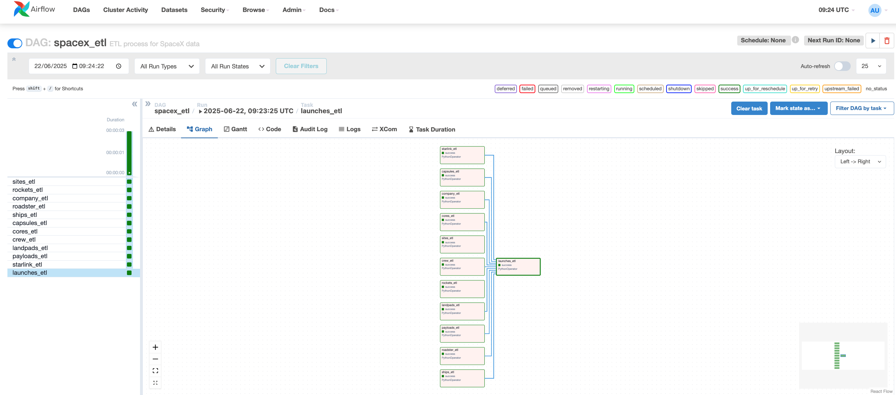

# ETL Process With Airflow

This directory contains the ETL process orchestrated by Apache Airflow.

## Directory Structure

```
with-airflow/
├── dags/                    # Airflow DAGs
│   └── spacex_etl_dag.py    # Main ETL DAG definition
├── docker-compose.yml       # Docker setup for database and Airflow
├── Dockerfile               # Airflow container configuration
├── requirements.txt         # Python dependencies for Airflow
├── database.env             # Database connection configuration
├── Makefile                 # Build and run commands
├── wait-for-it.sh           # Script to wait for database readiness
└── README.md                # This file
```

## Prerequisites

- Docker Compose version v2.31.0-desktop.2.
- Docker client / Docker engine 24.0.7.
- PostgreSQL client (psql) for database connectivity.

## Docker Compose Setup

I have created a custom image that extends the image `apache/airflow:2.9.1-python3.10`with
the `Python libraries required` and `etl API's`.

The `docker-compose.yml` runs 4 containers:

## How It Works

- Service `postgres` runs container with image `postgres:latest` creating `spacex_data db` and the
`SQL Star schema`.
- Service `airflow-init` runs container with image `etl-airflow:latest` creating the Airflow database,
users, and initial setup.
- Service `airflow-webserver` runs container with image `etl-airflow:latest` launching the Airflow UI.
- Service `airflow-scheduler` runs container with image `etl-airflow:latest` launching the  Airflow
Scheduler.
- User login in the Airflow-UI in http://localhost:8080 and login with `admin/password` credentials.
- User manually run the `spacex_etl DAG`

  
The following screenshot provides the Airflow UI:




## Setup

1. Build and run using the Makefile:
```bash
# Build the Docker images
make build

# Start all services (database, init job, webserver, scheduler)
make up

# View logs of the webserver
make logs

# View logs of the scheduler
make scheduler-logs

# View the logs for all the containers
make all-logs

# Stop and remove the containers
make stop

# Stop, remove the containers and clean volumes
make clean
```
