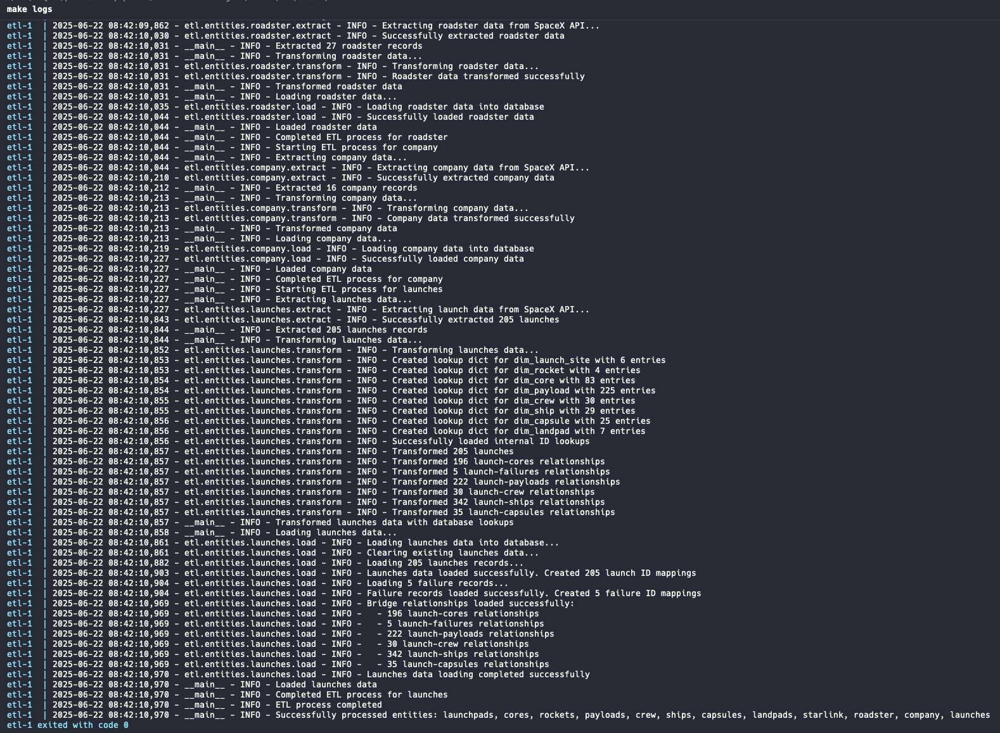

# ETL Process Without Airflow

This directory contains a simplified version of the ETL process that can be run without Airflow.

## Directory Structure

```
without-airflow/
├── run_etl.py               # Main ETL execution script
├── docker-compose.yml       # Docker setup for database and ETL script
├── Dockerfile               # ETL script container configuration
├── requirements.txt         # Python dependencies for ETL
├── database.env             # Database connection configuration
├── Makefile                 # Build and run commands
├── .dockerignore            # Docker ignore file
└── README.md                # This file
```

## Prerequisites

- Docker Compose version v2.31.0-desktop.2.
- Docker client / Docker engine 24.0.7.
- PostgreSQL client (psql) for database connectivity.

## Docker Compose Setup

I have created a custom image that extends the image `python:3.11-slim` with
the `Python libraries required`, `etl API's` and the Python script `run_etl.py`.

The `docker-compose.yml` runs 2 containers:

- Service `postgres` runs container with image `postgres:latest` creating `spacex_data db` and the
`SQL Star schema`.
- Service `etl` runs container with image `etl-without-airflow:latest` invoking ETL Python script
`run_etl.py`:
  - Extract all the SpaceX entities from SpaceX API.
  - Transform the original data set into the SpaceX Star schema data model.
  - Load to PostgresSQL.

The following screenshot provides the logs of the process:



## Setup

1. Build and run using the Makefile:
```bash
# Build the Docker image that encapsulates the ETL logic
make build

# Run the ETL process
make run

# View logs
make logs

# Stop and remove the containers
make stop

# Stop, remove the containers and clean volumes
make clean
```

## Scheduling the SpaceX DAG

Currently, the DAG is triggered manually. In a production environment, scheduling would be
essential. However, it’s important to understand how frequently the source data updates. Also,
deciding whether to do a full data refresh or incremental updates (deltas) is important. Incremental
updates are usually preferred to avoid unnecessary processing, but they do add some complexity.

## Monintoring Apache Airflow cluster

Apache Airflow can expose metrics to Prometheus. A good reference on this setup is the
[Logging and Monitoring architecture](https://www.redhat.com/en/blog/monitoring-apache-airflow-using-prometheus).
There are also official and community Grafana dashboards available that can be reused.
 

